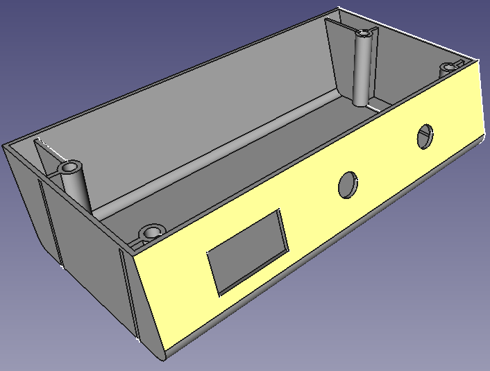
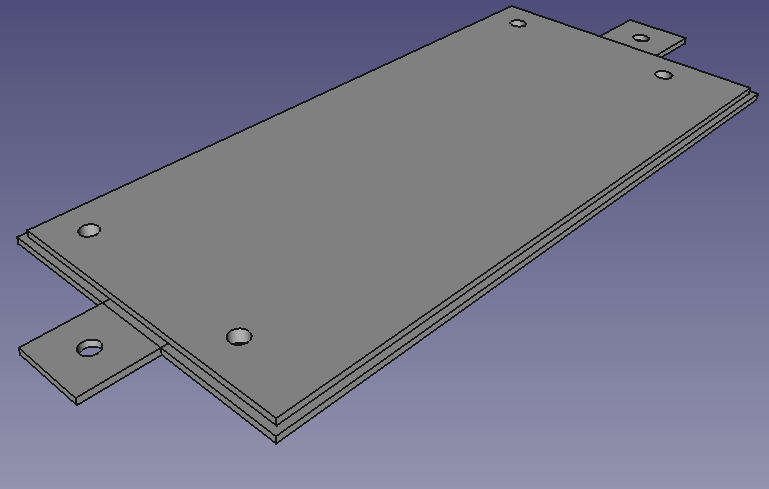

# Hafele Standing Desk

## WiFi-Control Modification

### Overview

This project details the steps to modify a Hafele® Standing Desk to be controlled via WiFi.

## Table of Contents

1. [Overview](#overview)
2. [Hardware](#hardware)
   - [Materials](#materials)
   - [Case Design](#case-design)
   - [Renders of the Case](#renders-of-the-case)
3. [Software](#software)
   - [Firmware](#firmware)
   - [Firmware Compilation & Deployment](#firmware-compilation--deployment)
4. [System Features](#system-features)
5. [Technical Specifications](#technical-specifications)
6. [Contributing](#contributing)
7. [References](#references)

### Hardware

#### Materials

- **Printing Filament:**
  - Case: Approximately 52 grams and 17.46 meters
  - Lid: Approximately XX grams and YY meters

- **Electronics:**
  - **CPU:** Wemos D1 ESP32, 160~240 MHz, 320 KiB RAM
  - **Display:** OLED 128x64 px i2C SSD1306, viewable area: 14.7x26.7 mm
  - **Relay Module Shield:** 2 CH

#### Case Design

The case was parametrically designed using FreeCAD 0.0.19 with adjustable parameters:

- Length
- Height
- Width
- Display dimensions (width and height)
- Radius of curvature
- Panel angle
- Wall thickness
- Display position (x and y)
- Button distance
- Lid thickness
- Bolt diameter, length, and separation
- Inner diameter of bolt nuts

##### Provided Files

The following files are included in the `plastic_case` directory:

- `control_box.stl`: STL file for the main control box.
- `control_box_lid.stl`: STL file for the lid of the control box.
- `hafele_control_box_with_lid.FCStd`: FreeCAD source file for the control box and lid.
- `control_box_render.png`: Rendered image of the control box.
- `control_box_lid_render.png`: Rendered image of the control box lid.

#### Renders of the Case




### Software

#### Firmware

The firmware was developed in Arduino C++, based on the [WiFi Manager platform](https://github.com/tzapu/WiFiManager).

Current version: v1.1.9

#### Firmware Compilation & Deployment

1. **Install Docker:**

   If you don't have Docker installed, follow the instructions [here](https://docs.docker.com/get-docker/).

2. **Compile the Source Code:**

   Run the `build.sh` script to compile the firmware using Docker:

   ```bash
   cd firmware
   ./build.sh
   ```

3. **Compile and Upload with OTA:**

   ```bash
   make TARGET_IP=x.x.x.x
   ```
   (Replace `x.x.x.x` with the device's IP address)

### System Features

#### Core Functionality
- Height adjustment with position memory (M1, M2)
- Real-time clock display
- System calibration
- Lock mode for safety
- Debug mode for troubleshooting

#### User Interface
- OLED display (128x64 pixels)
- Rotary encoder for navigation
- Two control buttons (Enter, Back)
- Intuitive menu system

#### Movement Control
- Continuous up/down movement
- One-second movement increments
- Full up/down positions
- Memory positions (M1, M2)
- Height limits with safety margins

### Technical Specifications

#### GPIO Configuration
- Motor Control:
  - Up Relay: GPIO32
  - Down Relay: GPIO33
- User Interface:
  - Enter Button: GPIO34
  - Back Button: GPIO35
  - Encoder A: GPIO18
  - Encoder B: GPIO19

#### System Limits
- Maximum Height: 1220mm
- Minimum Height: 725mm
- Safety Margin: 5mm

#### WiFi Configuration
- Default AP Name: "WIFI_STANDING_DESK"
- Default AP Password: "PASSWORD"
- Non-blocking configuration portal
- OTA update support

#### Dependencies
- WiFiManager: WiFi configuration
- Adafruit_GFX: Display graphics
- Adafruit_SSD1306: OLED display control
- ESP32Encoder: Rotary encoder handling
- ArduinoJson: JSON processing
- NTPClient: Time synchronization

#### Safety Features
- Watchdog Timer (2-second timeout)
- EEPROM error handling
- Movement limit validation
- Configuration validation
- Emergency stop functionality

### Contributing

For contributions, please send an email to the repository owner.

### References

- Photos of the case
- Screenshots of the STL file designed in FreeCAD
